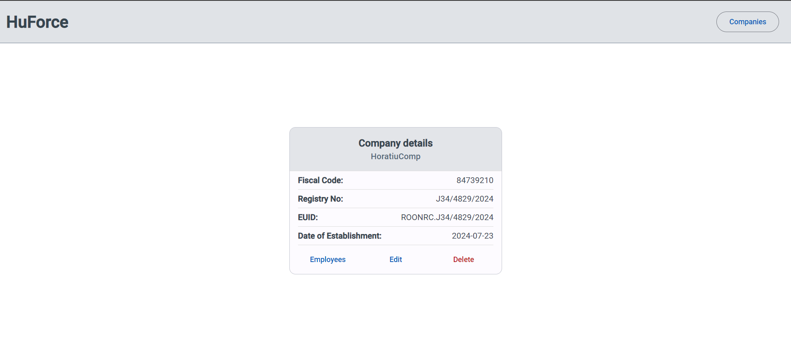
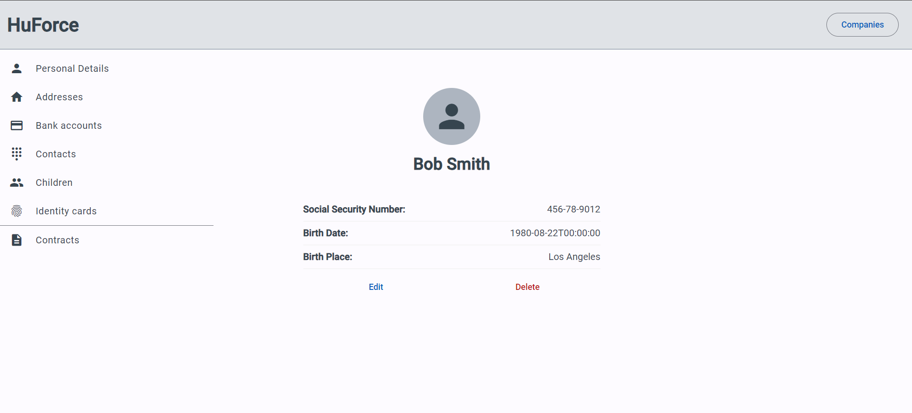
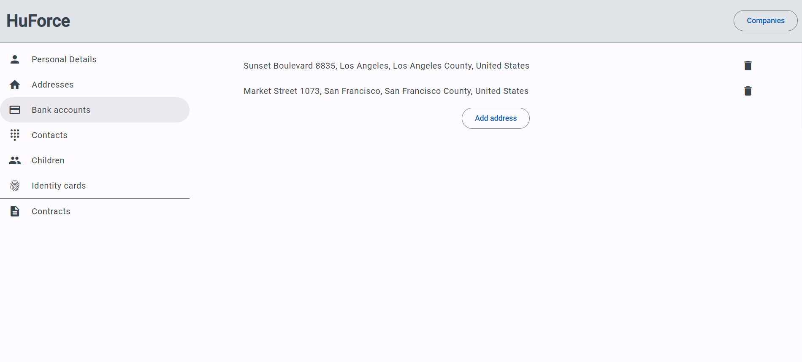
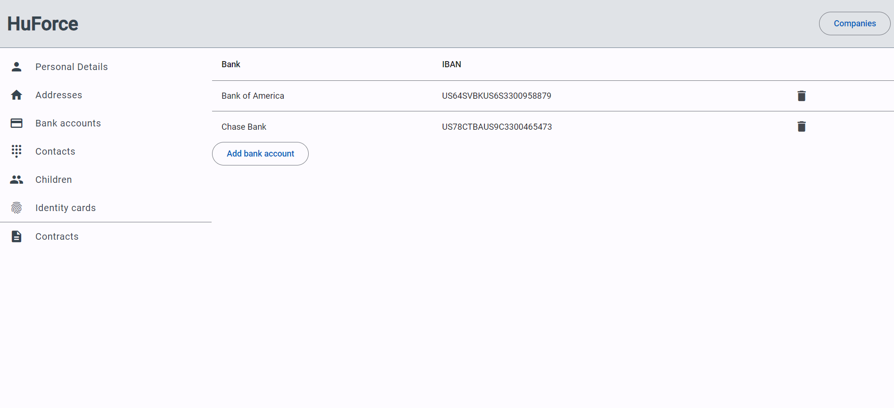
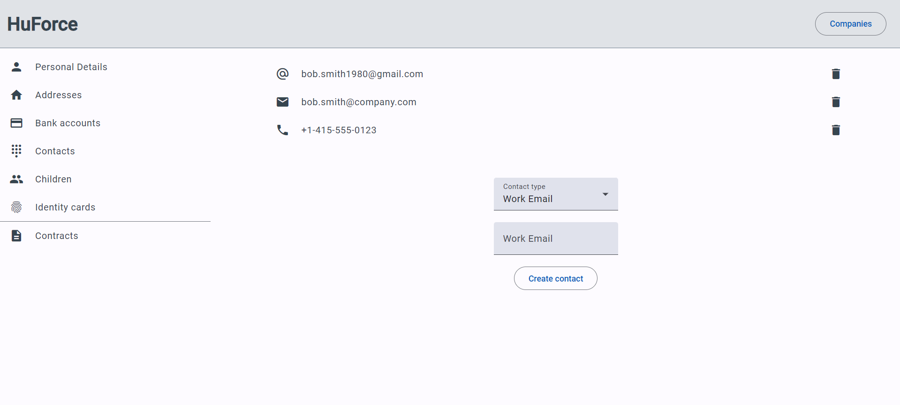
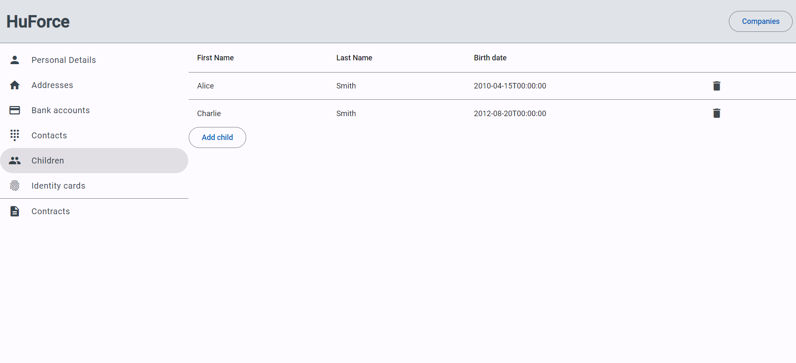
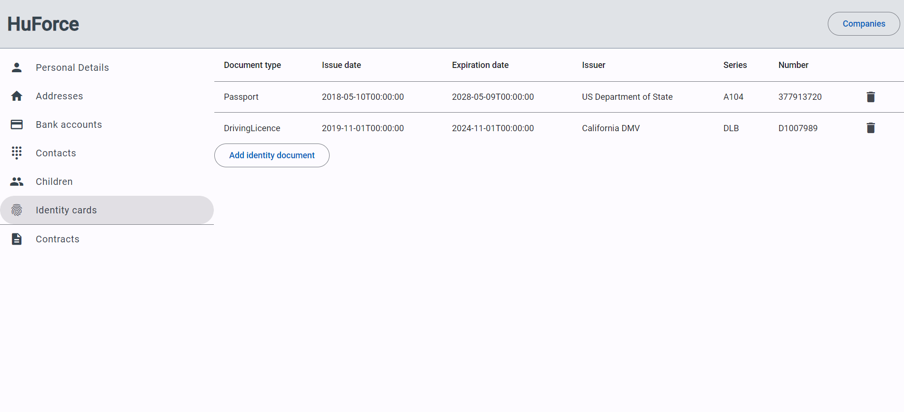
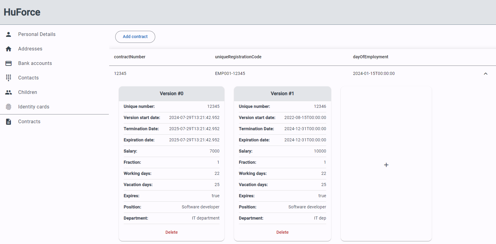

# HuForce

HuForce is a web application designed to help companies manage employee information, including personal details, contact information, employment contracts, and more. It also offers additional features such as document uploads and company-wide reports. Angular was used for developing this application.

## Features

### Company Management
- Manage information related to the company.
- Each company should have a fiscal code, registry number, EUID and a date of establishment.

### Employee Management
Each employee record includes the following information:
- **Personal Information**: 
  - Name, Surname, Social security number, Date of Birth, Place of Birth. 
    
- **Addresses**:
  - Multiple addresses (City, Street, Number, County, Country) for official documents or temporary residence.
    
- **Bank Details**:
  - Multiple bank accounts with support for multiple accounts at the same bank.
    
- **Contacts**:
  - Multiple contact methods (Personal email, Work email, Phone, Whatsapp, Teams).
    
- **Children**:
  - Information about the dependants.
    
- **Identity Documents**:
  - Identity Cards (ID series, number, valid from, expires on, issuer).
  - Passports.
  - Driver's Licenses.
    
- **Contracts**:
  - Multiple contracts per employee.
    

### Contract Management
Each contract contains:
- **Unique Registration Code**: 
  - Generated by combining employee code and contract number.
- **Version Management**:
  - Each contract can have multiple versions.
  - Each version includes start date, salary, work fraction, workdays, contract duration type.
  - Automatic generation of contract version numbers and additional act numbers when changes occur (e.g., salary, position, department).
